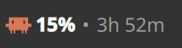
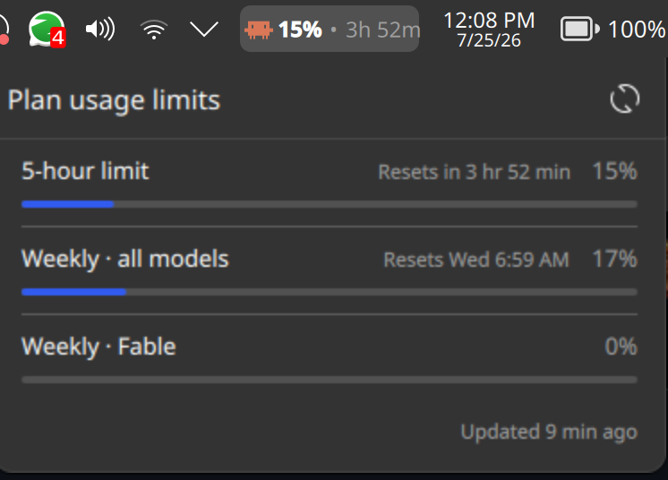
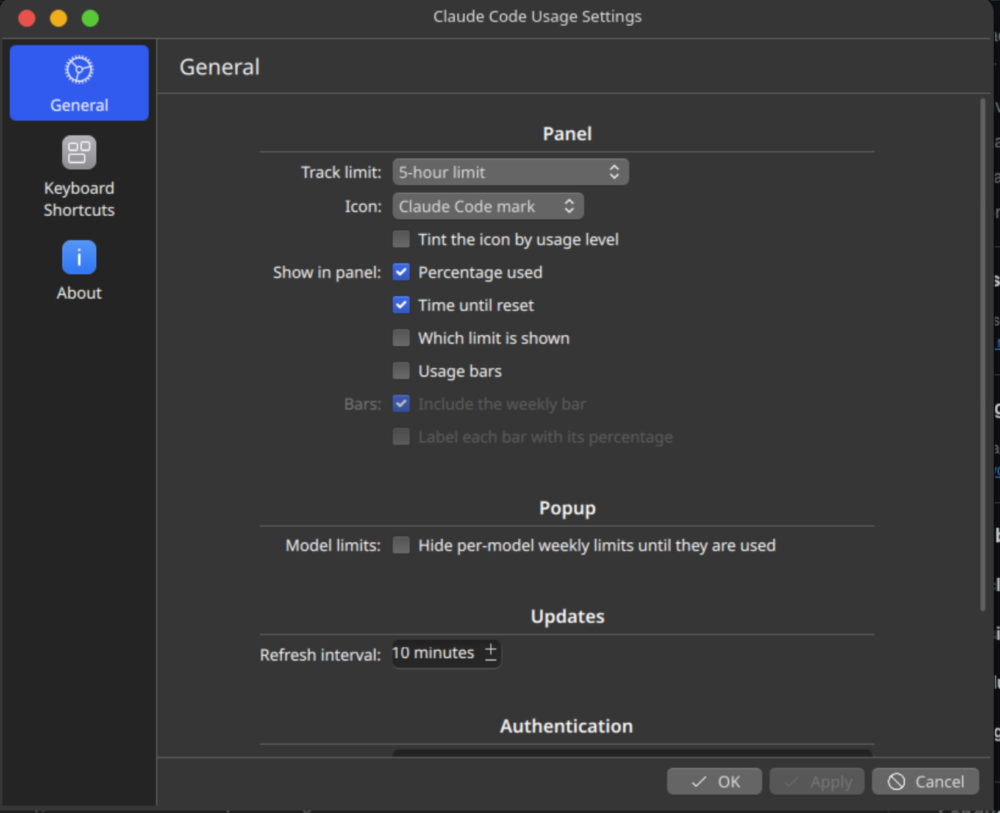

# Claude Code Usage — KDE Plasma 6 Widget

A panel widget that shows your Claude Code token usage at a glance. Sits alongside your clock, network widget, etc.



*In the panel: the Claude Code mark, percentage used, and time until reset.*

Click it for the full breakdown:



## Features

- **Claude-style popup** — laid out like the Claude desktop app's plan usage panel:
  one row per limit with a reset summary, percentage, and a thin accent rail
- **Every limit, automatically** — the 5-hour and weekly caps plus any per-model
  weekly limit the API reports (Fable, Sonnet, Opus), with no code change needed
  when a new one appears
- **Composable panel readout** — icon, percentage, countdown, limit tag and bars are
  independent, and you choose which limit they track
- **Color-coded** — green under 70%, amber to 90%, red beyond, so you see a cap
  coming without reading the number
- **Middle-click to refresh** — without opening the popup
- **Auto-refreshing** — polls the Anthropic usage API on a configurable interval (default 10 min)
- **Automatic token refresh** — when the OAuth token expires, the widget re-runs the Claude CLI to renew it
- **Horizontal and vertical panels** — sizing adapts to the panel orientation
- **Theme-aware** — uses Kirigami/Plasma theme colors, so it follows your accent color

### Panel display

The panel readout is built from independent parts, so you can compose exactly what
you want — the screenshot above is `[mark] 15% • 3h 52m`:

| Part | Default | Notes |
|------|---------|-------|
| Icon | Claude Code mark | Or the spark glyph, or none |
| Percentage used | On | Turns amber past 70%, red past 90% |
| Time until reset | On | Compact form: `3h 52m`, `13m`, `2d 3h` |
| Which limit is shown | Off | Short tag such as `5h`, `7d`, `Fable` |
| Usage bars | Off | Thin `5h` / `7d` rails |

**Icon-only mode:** turn off percentage, reset time, label and bars. The icon alone
carries the signal, and the tooltip still lists every limit on hover. (Turning off
*everything* would leave nothing to click, so the icon is forced back on.)

**Icon colour** has three modes:

| Mode | Behaviour |
|------|-----------|
| Always Claude's colour | Never recolours |
| Amber past 70%, red past 90% | Claude's colour at rest, warns only when it matters (default) |
| Green, amber, red by level | Coloured at every level |

The percentage text follows the same 70% / 90% steps, so the warning survives even
with the icon left in Claude's own colour.

**Track limit** picks which limit drives the icon, percentage, and countdown:
the 5-hour limit (default), the weekly limit, any per-model limit the API reports,
or *Highest limit (automatic)*. The picker is populated from limits actually seen on
your account, so `Weekly · Fable` appears once your plan reports it.

Pick **Highest** if you would rather be warned about whichever cap you are nearest,
whichever one that happens to be.

## Requirements

- KDE Plasma 6
- Claude Code with OAuth login (`~/.claude/.credentials.json` must exist)

## Install

```bash
git clone https://github.com/fluffyspace/claude-plasma-widget.git
cd claude-plasma-widget
bash install.sh --restart
```

Then right-click your panel → **Add Widgets** → search **Claude Code Usage** → drag to panel.

## Update

```bash
bash install.sh --restart
```

`--restart` clears the QML cache and restarts plasmashell, which is required for
plasmashell to pick up changed QML. Omit it to install without restarting.

## Uninstall

```bash
kpackagetool6 -t Plasma/Applet -r com.github.claude-code-usage
```

## Configuration

Right-click the widget → **Configure**:



**Panel** — see the table above, plus **Track limit**.

**Popup**

| Setting | Default | Description |
|---------|---------|-------------|
| Hide per-model weekly limits until used | Off | Collapses rows sitting at 0% |
| Show pay-as-you-go credit spend | Off | Adds an **Extra usage** row to the popup and tooltip |

Credit spend only appears if the account actually has pay-as-you-go enabled — the
API reports it as disabled, with null amounts, on accounts that never turned it on.
Amounts are shown in the account's own currency, e.g. `12.34 USD of 50.00 USD`.

**Updates**

| Setting | Default | Description |
|---------|---------|-------------|
| Refresh interval | 10 min | Time between API polls (15 s – 60 min) |

**Authentication**

| Setting | Default | Description |
|---------|---------|-------------|
| Credentials file | `~/.claude/.credentials.json` | Path to Claude Code credentials |
| Expired token | On | Auto-renew an expired token via the Claude CLI |
| Claude CLI path | *(empty)* | Full path to `claude`; empty searches `PATH` |

## Troubleshooting

**"Claude CLI not found"** — plasmashell is started by the session manager with a
minimal `PATH` (typically `/usr/local/bin:/usr/bin:/bin`), which excludes
`~/.local/bin` where Claude Code installs by default. The widget prepends the
usual install locations, but if your `claude` lives elsewhere, run `which claude`
in a terminal and paste the full path into **Claude CLI path** in the settings.

**"Token expired — run `claude` in a terminal to sign in again"** — the refresh
attempt did not produce a valid token. Run `claude` yourself to re-authenticate.

**Changes to the widget do not appear** — plasmashell caches compiled QML. Run
`bash install.sh --restart`.

## Credits

- Originally by [sizeak](https://github.com/sizeak/claude-plasma-widget), with the
  auto-refresh work from [fluffyspace](https://github.com/fluffyspace/claude-plasma-widget).
  This repo continues from that branch with a reworked UI and data model.
- Popup layout follows the plan usage panel in the Claude desktop app.
- The spark glyph and its colour thresholds come from
  [ClaudeUsageBar](https://github.com/Artzainnn/ClaudeUsageBar) (MIT), a macOS menu
  bar app for the same job.
- `package/contents/images/claude-code-icon.svg` is the Claude Code mark and belongs
  to Anthropic; it is bundled for identification only.

## License

MIT — see [LICENSE](LICENSE).
